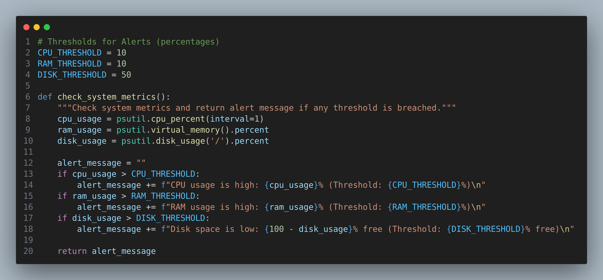

# Python System Monitoring Lab
Learn how to monitor server performance (CPU, RAM, Disk Usage) using Python and the psutil library. This lab also covers setting up metric thresholds and sending email alerts to administrators when limits are exceeded.


## Lab Objectives
By the end of this lab, you will:

- Use Python's psutil library to monitor system metrics like CPU, RAM, and disk usage.

- Trigger email alerts when performance metrics exceed thresholds.

- Implement an alerting system using Mailjet.

- Integrate third-party libraries to build monitoring tools.

## Lab Tasks

### Task 1: Sign up for Mailjet Email API

- Sign up for Mailjet's free email SMTP service.

- Create an API Key & Secret Key on the Mailjet Developer Portal.

- Refer to the Mailjet documentation for assistance.

### Task 2: Python Environment Setup

- Set up a Python virtual environment:
```bash
    python3 -m venv <environment_name>
```
- Install required libraries:
```bash
    pip install psutil mailjet_rest
```

### Task 3: Create your script
- Create your file
```bash
    touch monitor.py
```

- Import the necessary files and set up your variables.
  

- Create email alert function
 

- Define your thresholds and create your metrics function
 

- Main function of your script
  
  
- Run script
```bash
    python monitor.py
```
### Task 4: Check email inbox/spam folder
- Evidence of system metrics in email spam/inbox
 

